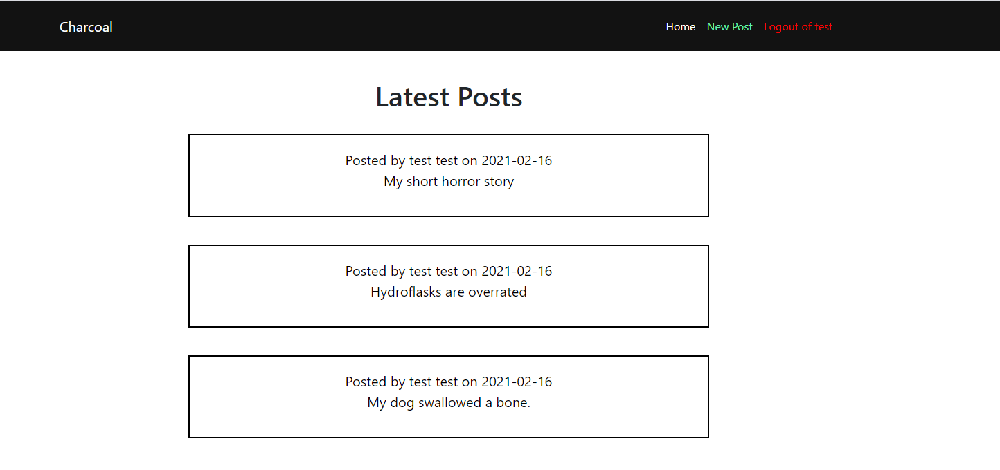
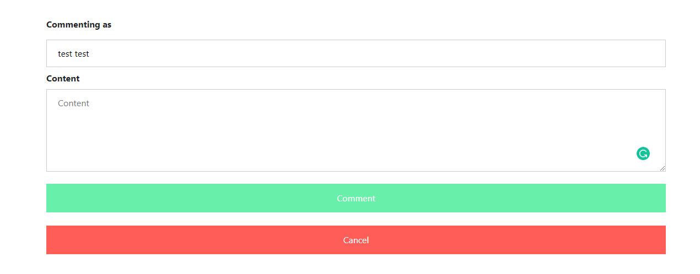
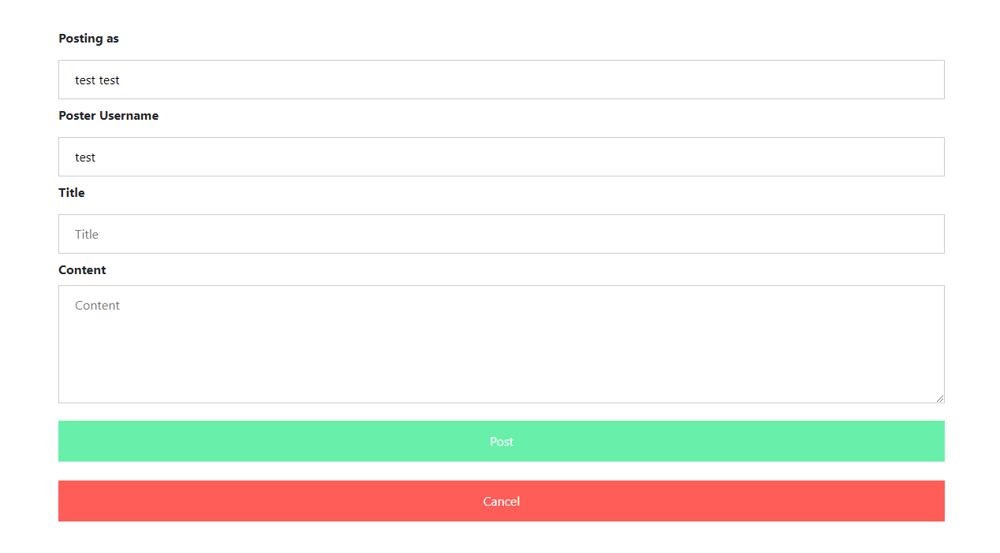
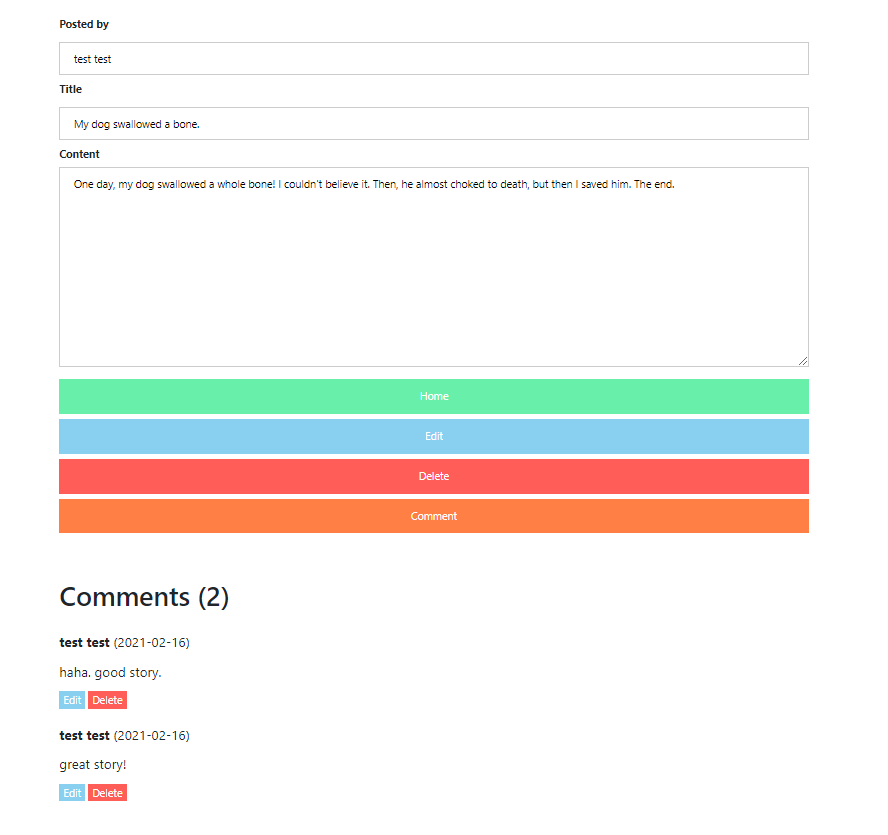
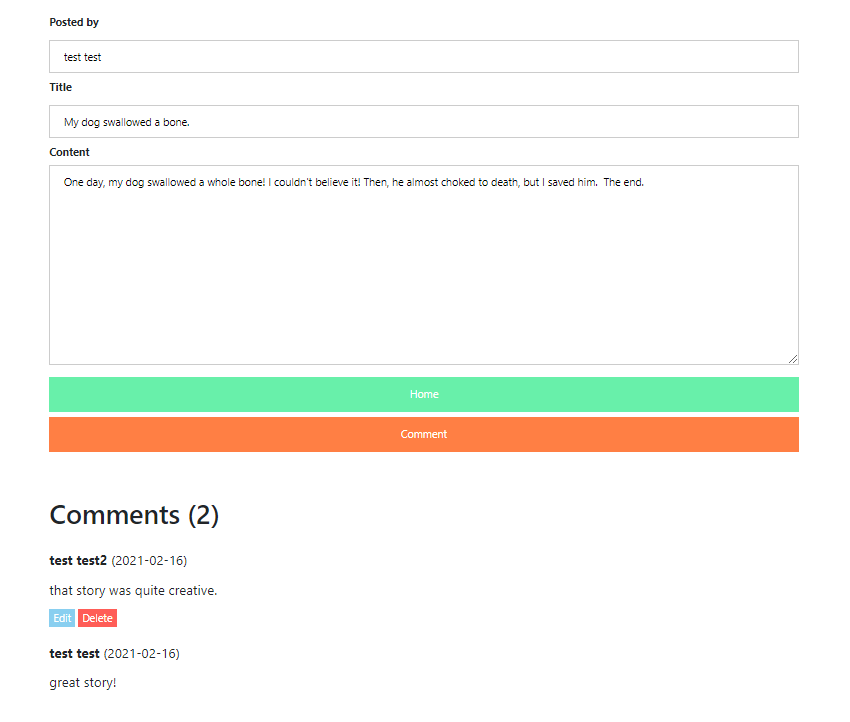

# Charcoal

Webapp to create and share posts (basically a reddit clone)

# Features
 - make new posts
 - edit posts
 - delete posts
 - comment on posts
 - edit comments
 - delete comments

# Gallery
| | 
|:--:| 
| *Posting new comment* |

| | 
|:--:| 
| *Creating new post* |

| | 
|:--:| 
| *POV of the OP. They are able to manage the post and its comments.* |

| | 
|:--:| 
| *POV of the viewer. They are only able to comment and view the post.* |
