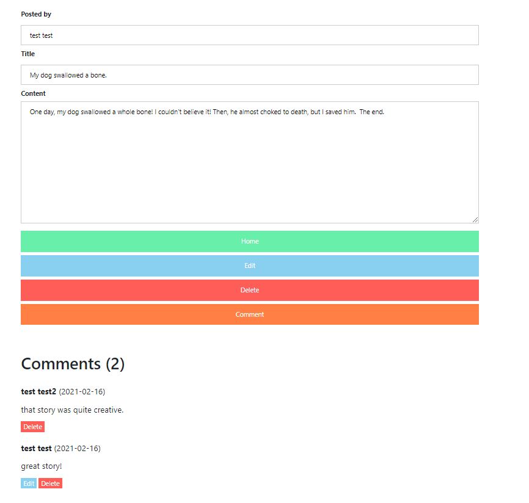

# Charcoal

webapp to create and share posts (basically a reddit clone)

# features
 - make new posts
 - edit posts
 - delete posts
 - comment on posts
 - edit comments
 - delete comments

# gallery
| | 
|:--:| 
| *Adding new comment* |

| | 
|:--:| 
| *creating new post* |

| | 
|:--:| 
| *POV of the OP. They are able to manage the post and its comments.* |

| | 
|:--:| 
| *POV of the viewer. They are only able to comment and view the post.* |
